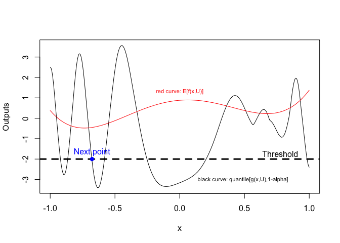

EFISUR a new acquisition function (infill sampling criterion)
================
Reda El Amri
2021-03-14

## Description

We consider the problem of chance constrained optimization where it is
sought to optimize a function and satisfy constraints, both of which are
affected by uncertainties. The real world declinations of this problem
are particularly challenging because of their inherent computational
cost.

We propose a new Bayesian optimization method. It applies to the
situation where the uncertainty comes from some of the inputs, so that
it becomes possible to define an acquisition criterion in the joint
controlled-uncontrolled input space (see the paper for more details
<https://arxiv.org/pdf/2103.05706.pdf>).

## Load R-packages

``` r
library('DiceDesign', quietly = TRUE)
library('DiceKriging', quietly = TRUE)
library("nloptr", quietly = TRUE)
library("randtoolbox", quietly = TRUE)
```

    ## This is randtoolbox. For an overview, type 'help("randtoolbox")'.

## Initialization

``` r
Objective_function <- fct1
Constraint_function <- list(fct2) # as a list

d <- 1 # dim of the control space
m <- 1 # dim of the uncertain space
bornesControl <- rbind(c(-1,1)) #X-space
bornesUncert <- rbind(c(0.35,0.65)) # U-space
bornes <- rbind(bornesControl,bornesUncert) #joint-space
seuil <- -2 # the thresholds (a vector if multiple constraints, e.g., c(3,4,6,9))
sign <- "<" # a vector if multiple constraints, e.g., c(">",">",">","<","<")
alpha <- 0.05 # parameter that controls the probability of constraint satisfaction
N <- 200 # realizations to estimate the probability of A
M_CRN <- 50 # CRN (Commmun Random Numbers)
alea <- matrix(randtoolbox::sobol(M_CRN,m),ncol=m)
for(i in 1:m) alea[,i] <- bornes[(i+d),1] + (bornes[(i+d),2] - bornes[(i+d),1])*alea[,i]

########################################################
##############  Initial Design of Experiments (DoE)
########################################################

n = 30*(d+m) # initial design size
DoE = lhsDesign(n,d+m)$design # initial LHS design in the joint space
DoE  <- maximinSA_LHS(DoE)$design # maximin-LHS design in the joint space
for(i in 1:(d+m)) DoE[,i] <- bornes[i,1] + (bornes[i,2] - bornes[i,1])*DoE[,i]

########################################################
##############  Initial Gaussian Process models
########################################################
 
d_c <- length(Constraint_function) # number of constraint functions
listCon <- NULL
response_f <- apply(DoE, 1, Objective_function) # objective function responses f(x,u)
model_O <- km(formula= ~1, design = data.frame(x=DoE), response= response_f,estim.method="LOO",
              control = list(trace=F),lower=rep(1e-10,d+m)) # GP of the objective function
for(l in 1:d_c){
  response_const <- apply(DoE, 1, Constraint_function[[l]]) # constraint function responses g(x,u)
  model_Const <- km(formula= ~1, design = data.frame(x=DoE), response= response_const,estim.method="LOO",
                    control = list(trace=F),lower=rep(1e-10,d+m)) # GP of the constraint functions
  listCon[[l]] <- model_Const
}
```

## Call the acquisition function: EFISUR

``` r
solver <- "bobyqa" # choose the solver ("bobyqa or "discrete")
result <- EFISUR(model_O,listCon,bornes,d,m,alea,N,alpha,sign,seuil,solver)
```

## Plot

<!-- -->

    ## [1] "Next point (x,u) =  -0.701808587182313 0.35"

    ## [1] "Best point x =  -0.677123573663024"

    ## [1] "cost =  -0.445825094991464"
